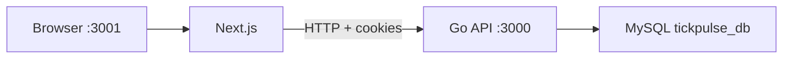

# TickPulse

A personal task manager with lists, categories, and a calendar view.

The UI is a Next.js app. The API is Go (Gin) with MySQL. Tasks and categories keep a stable custom order using LexoRank on the server; the client only sends neighbor ids when something is dragged.

## Highlights

- **Cookie session auth** with per-user isolation. Automated tests cover wrong passwords, forged cookies, logout invalidation, and cross-user CRUD.
- **LexoRank ordering** in the Go backend. Drag-and-drop submits `prev_id` / `next_id` (or a block of `ids` for multi-select). Rank strings are computed on the server, not in the browser.
- **Multi-select reorder.** Ctrl/Cmd click and Shift range-select; dragging one selected task moves the whole block and preserves relative order (`PUT /api/tasks/reorder`).
- **Schema bootstrap.** On startup the API creates the database if needed, ensures tables, and migrates `Tasks.sort_order` from `DOUBLE` to LexoRank `VARCHAR` when it is still the old type.
- **Go tests against real MySQL.** `go test` starts a temporary HTTP server, uses the same schema as local dev, and deletes the test user when it finishes. You do not need to run the API first.

An older Node/Express backend still lives under `tickpulse/backend` as a leftover from the first implementation. Day-to-day development and tests use the Go server.

## Features

- Email/password sign-up and login; Google OAuth is optional
- Categories with CRUD; the Inbox category cannot be deleted
- Tasks with name, Markdown content, status, priority, and deadline
- Calendar view of dated tasks
- Drag-and-drop order for categories and tasks
- Dark mode

License-key endpoints (`GET` / `PUT /api/license`) exist in Go but are **not** enforced on sign-up or the calendar. They are leftover product scaffolding, not a shipping feature.

## Tech stack

| Layer | Stack |
|---|---|
| Frontend | Next.js 15 (App Router), React 19, Tailwind CSS |
| API | Go 1.23, Gin, cookie sessions |
| Database | MySQL 8 |
| Auth | Local passwords (bcrypt) + optional Google OAuth 2.0 |

## Architecture



```text
.
├── README.md                 ← you are here
└── tickpulse/
    ├── src/                  ← Next.js app (pages, components, API client)
    ├── backend-go/           ← current API, tests, and seed tool
    └── backend/              ← legacy Node API; not required
```

Frontend and API must run together. Both backends listen on port **3000**, so do not start Go and Node at the same time. Next.js must use port **3001** so CORS (`http://localhost:3001`) matches the API.

## Getting started

**Needs:** Node.js 18+, Go 1.23+, MySQL 8+ running locally, two terminals.

### 1. Install frontend dependencies

```bash
cd tickpulse
npm install
```

Go modules download on the first `go run` / `go test`. You do not need `npm install` in `backend/` unless you are running the legacy Node server.

### 2. Configure MySQL and `.env`

The Go server reads `tickpulse/backend/.env` (it also checks `backend-go/.env`). Create `tickpulse/backend/.env` with at least:

```env
MYSQL_HOST=localhost
MYSQL_USER=root
MYSQL_PASSWORD=your_mysql_password
MYSQL_DATABASE=tickpulse_db

PORT=3000
ACCESS_TOKEN_SECRET=any-long-random-string
CLIENT_URL=http://localhost:3001
```

Google login is optional. Omit `GOOGLE_CLIENT_ID`, `GOOGLE_CLIENT_SECRET`, and `GOOGLE_CALLBACK_URL` if you only need email/password.

If the database does not exist yet, the Go server runs `CREATE DATABASE IF NOT EXISTS tickpulse_db` and creates tables on startup.

### 3. Start the Go API

```bash
cd tickpulse/backend-go
go run ./cmd/server
```

You should see MySQL connected, tables ensured, and `Listening and serving HTTP on :3000`. Gin debug warnings (debug mode, trusted proxies) are normal in local development.

### 4. Start the frontend

In a second terminal:

```bash
cd tickpulse
npm run dev -- -p 3001
```

Open [http://localhost:3001](http://localhost:3001).

### 5. Seed a local demo user

`go test` creates users and deletes them, so those accounts cannot log into the UI. Seed a stable user with:

```bash
cd tickpulse/backend-go
go run ./cmd/inituser
```

**Local demo only** (reused if it already exists; extra random categories and tasks are appended):

| | |
|---|---|
| Email | `test@tickpulse.com` |
| Password | `Password.123!` |

Defaults: 5 extra categories and 16 tasks. Override with `INIT_CATEGORIES`, `INIT_TASKS`, `INIT_EMAIL`, or `INIT_PASSWORD`. Then sign in at [http://localhost:3001/login](http://localhost:3001/login).

## Tests

Do **not** start the API first. The suite spins up a temporary HTTP server, talks to real MySQL, and cleans up.

```bash
cd tickpulse/backend-go
go test ./internal/models ./internal/license ./test_module -count=1 -v
```

What it covers:

- LexoRank helpers (`internal/models`)
- License key catalog (not used by the product flow yet)
- Register → login → create task → list categories; creating a task after logout returns 401
- Two-user session isolation, forged cookies, logout
- Bad password, duplicate email, cross-user read/write/delete, Inbox cannot be deleted, tasks move back to Inbox when a category is removed

Optional query timing (seeds data, times a list query, deletes the temp user):

```bash
TICKPULSE_STRESS=1 TICKPULSE_STRESS_N=10000 \
  go test ./test_module -run TestListTasksQueryTiming -count=1 -v
```

## Troubleshooting

**`Error 1049 Unknown database 'tickpulse_db'`**  
MySQL is up but the database is missing. Current Go startup creates it; if this still appears, check `MYSQL_DATABASE` in `.env` and that mysqld is running.

**`Error 1045 Access denied`**  
`MYSQL_USER` / `MYSQL_PASSWORD` do not match your local MySQL.

**Frontend loads but login fails / CORS errors**  
Frontend on 3001, API on 3000, only one process bound to 3000.

**Google login does not complete**  
Configure OAuth in Google Cloud and set `GOOGLE_CLIENT_ID`, `GOOGLE_CLIENT_SECRET`, and `GOOGLE_CALLBACK_URL`. Email/password login does not need this.

## Status

Local development only. There is no production deploy or public demo yet. License checks are intentionally off so local and demo use is not blocked.

Likely next steps: a hosted demo, wiring license into sign-up or calendar if that product path returns, and a screenshot/GIF in this README.

---

Originally built as a course project; continued afterwards as a personal project.
